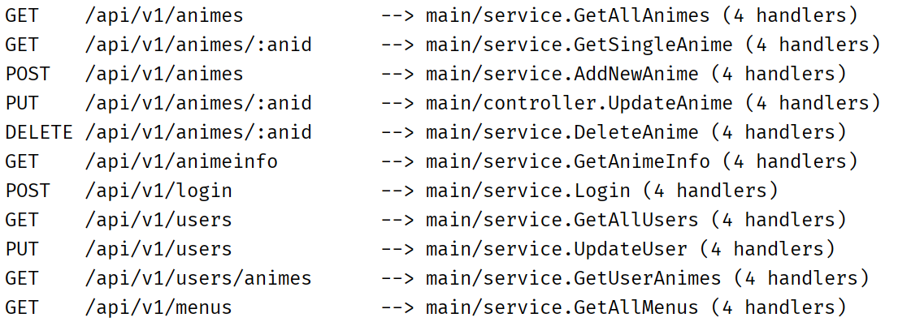

# Rip 进度管理系统（后端）
　　为了避免重复占坑而写的管理系统的后端。功能简单，Bug 众多，仍处于开发中。使用 Go + GORM 开发。前端左转 [rip-admin-web](https://github.com/myloft/rip-admin-web)
### API
　　Restful 风格接口，塞满了各种丑陋的参数，还有 toke + 明文保存密码的窒息操作，迟早重构...  

